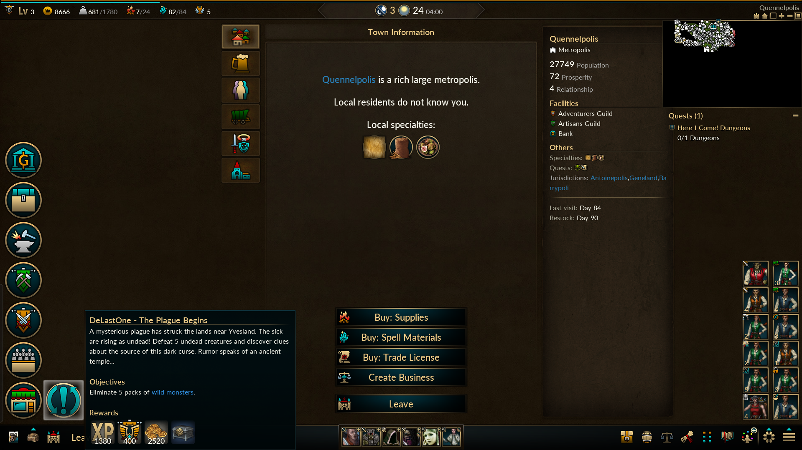
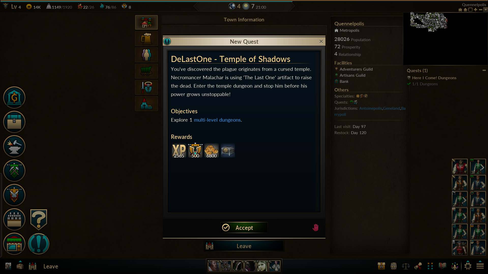
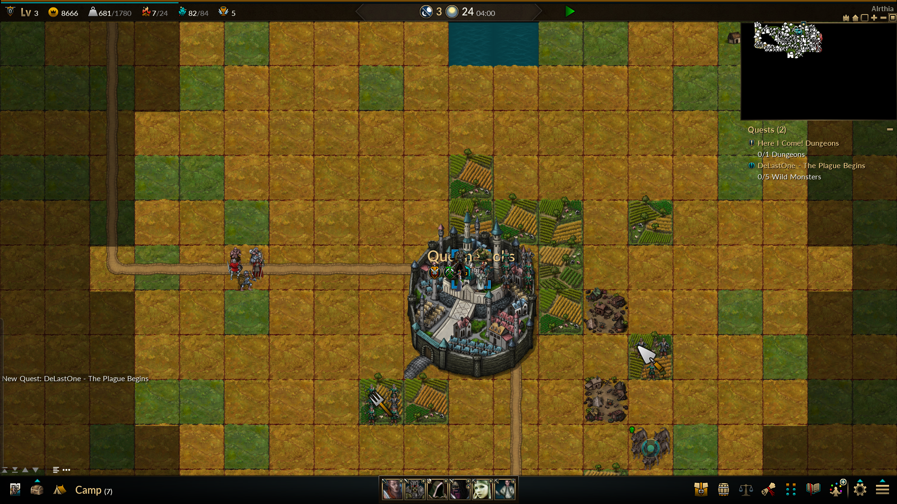

# DeLastOne Adventure - Custom Quest Chain for Low Magic Age


A custom 3-quest adventure chain for Low Magic Age's grid-based world map mode, featuring a classic D&D-style undead plague storyline.

---

## 🎮 Overview

**Story:** A mysterious plague is turning villagers into undead. The ancient Temple of Shadows holds dark secrets, and a necromancer named Malachar seeks to use a cursed artifact called "The Last One" to raise an undead army. You must stop him before it's too late!

**Quest Chain:**
1. **The Plague Begins** - Defeat 5 undead creatures (600 XP + 400 AXP + 300 Gold)
2. **Temple of Shadows** - Complete 1 dungeon (900 XP + 500 AXP + 500 Gold)
3. **The Final Ritual** - Defeat 8 corrupted followers (1500 XP + 600 AXP + 1000 Gold)

**Total Rewards:** 3000 XP + 1500 Adventurer XP + 1800 Gold + Equipment

---

## 📋 Requirements

- **Game:** Low Magic Age (Steam version)
- **Mode:** Grid-based world map adventure mode
- **Progress:** Complete Quest 103 ("Dungeon Skills") first

---

## 🚀 Quick Start

### Installation (5 minutes)

1. **Backup your game files** (see INSTALLATION.md)
2. **Copy 3 files** to your Low Magic Age installation:
   - `data/advt_data.lua`
   - `text/en/story_text.lua`
   - `wlds/wld_1_sites.txt`
3. **Start the game** and complete Quest 103
4. **Accept the quest** from Adventurer's Guild

📖 **[Full Installation Guide →](INSTALLATION.md)**

---

## 📸 Screenshots





---

## 🗺️ Features

### ✨ What's Included
- **3 Sequential Quests** - Unlocking progression system
- **Simple Objectives** - Kill monsters, complete dungeons (no complex dialogue)
- **D&D 3.5 Inspired** - Classic undead plague storyline
- **Full Localization** - English + Chinese text support
- **World Map Locations** - 3 decorative sites (Ashenvale Village, Temple, Ritual Site)

### ✅ Compatibility
- ✓ Works with **new adventures**
- ✓ Works with **existing saves**
- ✓ **No story.lua modifications** (prevents crashes)
- ✓ **Vanilla-compatible** (easy to uninstall)

### 🎯 Quest Types
- **Type:** Adventure Monthly Quest (`qt_aqst`)
- **Location:** Adventurer's Guild
- **Prerequisites:** Quest 103 completed
- **Chain:** 2001 → 2002 → 2003

---

## 📚 Documentation

- **[INSTALLATION.md](INSTALLATION.md)** - Complete installation guide
- **[DELASTONE_ADVENTURE_README.md](DELASTONE_ADVENTURE_README.md)** - Quest details, lore, and troubleshooting
- **[STATUS.md](STATUS.md)** - Current features, limitations, and roadmap
- **[CONTRIBUTING.md](CONTRIBUTING.md)** - How to contribute to the project
- **[LICENSE](LICENSE)** - MIT License

---

## 🛠️ For Developers

### Modified Files

```
data/advt_data.lua (Lines 828-831)
└── Adds 3 quest entries: 2001, 2002, 2003

text/en/story_text.lua (Lines 144-206)
└── Adds English translations

wlds/wld_1_sites.txt (Lines 330-332)
└── Adds 3 world map locations
```

### Quest Structure

```lua
[2001]={
    z="DeLastOne - 瘟疫开始",
    t=qt_aqst,              -- Adventure monthly quest
    req=103,                -- Requires Quest 103
    xp=600, axp=400, g=300, -- Rewards
    itms="eqp_rd_1",        -- Random equipment
    be=sf_adv,              -- Begin at Adventurer's Guild
    do_wmons=5,             -- Objective: Kill 5 monsters
    n="DeLastOne - The Plague Begins",
    d="[Description...]"
}
```

---

## ⚠️ Important Notes

### Two Adventure Modes in Low Magic Age

Low Magic Age has **TWO** different adventure systems:

1. **Story Mode** - Complex narrative quests with dialogue trees
2. **Grid-Based World Map Mode** - Simple objective-based quests ← **THIS MOD**

This mod is designed **ONLY** for grid-based world map mode.

### Why Sites Are Decorative

Custom locations (Ashenvale Village, Temple of Shadows, Ritual Site) appear on the map but:
- Cannot be entered (game crashes without internal map data)
- Not required for quest completion
- Added for immersion/roleplay only

The quests work by tracking **monster kills** and **dungeon completions** anywhere on the map.

---

## 🐛 Troubleshooting

| Problem | Solution |
|---------|----------|
| Quests don't appear | Complete Quest 103, restart game |
| Game crashes | Use v2.0+ (story.lua no longer modified) |
| Sites can't be entered | This is normal - sites are decorative |
| Next quest won't unlock | Fully complete previous quest first |

📖 **[Full Troubleshooting Guide →](DELASTONE_ADVENTURE_README.md#troubleshooting)**

---

## 🎲 Quest Chain Details

### Quest 2001: "The Plague Begins"
- **Objective:** Kill 5 world monsters
- **Rewards:** 600 XP + 400 AXP + 300 Gold
- **Story:** Investigate the undead plague near Yvesland

### Quest 2002: "Temple of Shadows"
- **Objective:** Complete 1 dungeon
- **Rewards:** 900 XP + 500 AXP + 500 Gold
- **Story:** Stop Necromancer Malachar in his temple

### Quest 2003: "The Final Ritual"
- **Objective:** Kill 8 world monsters
- **Rewards:** 1500 XP + 600 AXP + 1000 Gold
- **Story:** Destroy The Last One artifact forever

---

## 📦 Repository Structure

```
LowMagicAge-DeLastOne/
├── README.md                           # This file
├── INSTALLATION.md                     # Installation guide
├── DELASTONE_ADVENTURE_README.md       # Quest details & lore
├── LICENSE                             # MIT License
├── screenshots/                        # Quest screenshots
├── data/advt_data.lua                  # Quest definitions
├── text/en/story_text.lua              # English translations
└── wlds/wld_1_sites.txt                # World map locations
```

---

## 🤝 Contributing

Contributions welcome! Feel free to:
- Report bugs via Issues
- Submit pull requests for improvements
- Share screenshots of your playthrough
- Suggest new quest ideas

---

## 📄 License

MIT License - See [LICENSE](LICENSE) file

---

## 🙏 Credits

- **Game:** [Low Magic Age](https://store.steampowered.com/app/1057480/Low_Magic_Age/) by Low Magic Studios
- **Mod Creator:** Claude + Boris
- **Inspiration:** D&D 3.5 classic adventures
- **Version:** 2.0 (Grid-Based Mode - Working!)

---

## 🔗 Links

- **Steam Workshop:** (Coming soon)
- **Nexus Mods:** (Coming soon)
- **GitHub:** [This repository]

---

**Enjoy your adventure, and may your dice roll high!** 🎲⚔️

*For detailed quest information, see [DELASTONE_ADVENTURE_README.md](DELASTONE_ADVENTURE_README.md)*
